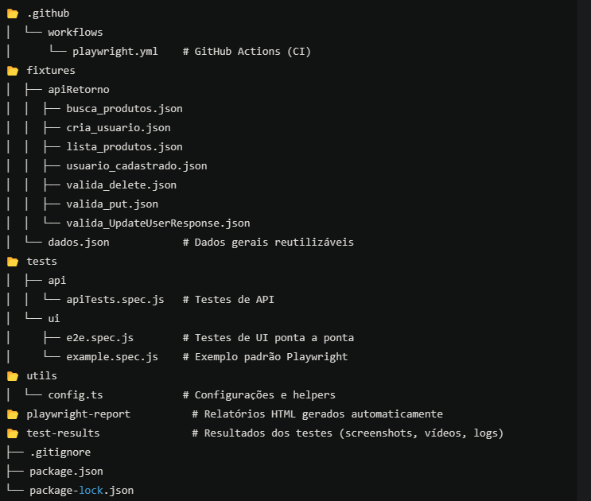

Organização do Projeto

BDD dos Casos de Testes

Funcionalidade 01: Cadastro de Usuário  
  Cenário: Cadastro de usuário com sucesso  
    Dado que o usuário acessa a página inicial  
    Quando o usuário clicar em "Signup / Login"  
    E preencher os dados de nome e e-mail  
    E preencher as informações da conta  
    E marcar as opções de newsletter e ofertas  
    E preencher os dados pessoais e endereço  
    E clicar no botão "Criar Conta"  
    Então a mensagem "ACCOUNT CREATED!" deve ser exibida  
    E o usuário deve estar logado  
    Quando o usuário clicar em "Delete Account"  
    Então a mensagem "ACCOUNT DELETED!" deve ser exibida  

Funcionalidade 02: Login com Credenciais Corretas  
  Cenário: Login bem-sucedido  
    Dado que o usuário acessa a página inicial  
    Quando o usuário clicar em "Signup / Login"  
    E preencher o e-mail e senha corretos  
    E clicar no botão "Login"  
    Então a mensagem "Logged in as username" deve ser exibida  
    Quando o usuário clicar em "Delete Account"  
    Então a mensagem "ACCOUNT DELETED!" deve ser exibida  

Funcionalidade 03: Login com Credenciais Incorretas  
  Cenário: Tentativa de login com erro  
    Dado que o usuário acessa a página inicial  
    Quando o usuário clicar em "Signup / Login"  
    E preencher o e-mail e senha incorretos  
    E clicar no botão "Login"  
    Então a mensagem "Your email or password is incorrect!" deve ser exibida  

Funcionalidade 04: Logout do Usuário  
  Cenário: Logout bem-sucedido  
    Dado que o usuário acessa a página inicial  
    Quando o usuário clicar em "Signup / Login"  
    E preencher o e-mail e senha corretos  
    E clicar no botão "Login"  
    E clicar no botão "Logout"  
    Então o usuário deve ser redirecionado para a página de login  

Funcionalidade 05: Cadastro de Usuário com E-mail Existente  
  Cenário: Tentativa de cadastro com e-mail já utilizado  
    Dado que o usuário acessa a página inicial  
    Quando o usuário clicar em "Signup / Login"  
    E preencher o nome e um e-mail já cadastrado  
    E clicar no botão "Signup"  
    Então a mensagem "Email Address already exist!" deve ser exibida  

Funcionalidade 06: Formulário de Contato  
  Cenário: Envio bem-sucedido do formulário de contato  
    Dado que o usuário acessa a página inicial  
    Quando o usuário clicar em "Contact Us"  
    E preencher nome, e-mail, assunto e mensagem  
    E anexar um arquivo  
    E clicar no botão "Submit"  
    Então a mensagem "Success! Your details have been submitted successfully." deve ser exibida  

Funcionalidade 07: Página de Casos de Teste  
  Cenário: Verificação da página de casos de teste  
    Dado que o usuário acessa a página inicial  
    Quando o usuário clicar em "Test Cases"  
    Então o usuário deve ser redirecionado para a página de casos de teste  

Funcionalidade 08: Visualizar Produtos e Detalhes  
  Cenário: Visualização dos produtos e detalhes  
    Dado que o usuário acessa a página inicial  
    Quando o usuário clicar em "Products"  
    Então a lista de produtos deve ser exibida  
    Quando o usuário clicar em "View Product" no primeiro produto  
    Então os detalhes do produto devem ser exibidos  

Funcionalidade 09: Pesquisa de Produto  
  Cenário: Pesquisa de produto  
    Dado que o usuário acessa a página inicial  
    Quando o usuário clicar em "Products"  
    E pesquisar por um produto  
    Então a mensagem "SEARCHED PRODUCTS" deve ser exibida  
    E todos os produtos relacionados à busca devem ser listados  

Funcionalidade 10: Assinatura na Página Inicial  
  Cenário: Cadastro na newsletter pela home  
    Dado que o usuário acessa a página inicial  
    Quando o usuário rolar até o rodapé  
    E inserir o e-mail para assinatura  
    Então a mensagem "You have been successfully subscribed!" deve ser exibida  

Funcionalidade 11: Assinatura na Página do Carrinho  
  Cenário: Cadastro na newsletter pela página do carrinho  
    Dado que o usuário acessa a página inicial  
    Quando o usuário acessar o carrinho  
    E rolar até o rodapé  
    E inserir o e-mail para assinatura  
    Então a mensagem "You have been successfully subscribed!" deve ser exibida  

Funcionalidade 12: Adicionar Produtos ao Carrinho  
  Cenário: Adição de produtos ao carrinho  
    Dado que o usuário acessa a página inicial  
    Quando o usuário acessar "Products"  
    E adicionar dois produtos ao carrinho  
    Então os produtos devem estar no carrinho com preços e quantidades corretas  

Funcionalidade 13: Verificação da Quantidade no Carrinho  
  Cenário: Adicionar quantidade personalizada ao carrinho  
    Dado que o usuário acessa a página inicial  
    Quando o usuário visualizar um produto  
    E aumentar a quantidade para 4  
    E adicionar ao carrinho  
    Então o produto deve aparecer no carrinho com a quantidade correta  

Funcionalidade 14: Finalizar Compra com Cadastro no Checkout  
  Cenário: Criar conta durante o checkout  
    Dado que o usuário adiciona produtos ao carrinho  
    Quando o usuário iniciar o checkout  
    E criar uma conta durante o processo  
    Então a compra deve ser finalizada com sucesso  

Funcionalidade 15: Finalizar Compra com Cadastro Prévio  
  Cenário: Criar conta antes de comprar  
    Dado que o usuário cria uma conta  
    Quando o usuário adiciona produtos ao carrinho  
    E conclui o checkout  
    Então a compra deve ser finalizada com sucesso  

Funcionalidade 16: Finalizar Compra com Login Prévio  
  Cenário: Login antes do checkout  
    Dado que o usuário acessa a página inicial  
    Quando o usuário faz login  
    E adiciona produtos ao carrinho  
    E conclui o checkout  
    Então a compra deve ser finalizada com sucesso  

Funcionalidade 17: Remover Produtos do Carrinho  
  Cenário: Remover produtos do carrinho  
    Dado que o usuário adiciona produtos ao carrinho  
    Quando o usuário acessar o carrinho  
    E remover um produto  
    Então o produto não deve estar mais no carrinho  

Funcionalidade 18: Visualizar Produtos por Categoria  
  Cenário: Filtrar produtos por categoria  
    Dado que o usuário acessa a página inicial  
    Quando o usuário selecionar uma categoria  
    Então os produtos da categoria devem ser exibidos  

Funcionalidade 19: Visualizar Produtos por Marca  
  Cenário: Filtrar produtos por marca  
    Dado que o usuário acessa a página inicial  
    Quando o usuário selecionar uma marca  
    Então os produtos da marca devem ser exibidos  

Funcionalidade 20: Verificar Produtos no Carrinho Após Login  
  Cenário: Manter itens no carrinho após login  
    Dado que o usuário adiciona produtos ao carrinho sem login  
    Quando o usuário fizer login  
    Então os produtos devem permanecer no carrinho  

Funcionalidade 21: Adicionar Avaliação a um Produto  
  Cenário: Enviar uma avaliação  
    Dado que o usuário acessa um produto  
    Quando o usuário preencher nome, e-mail e avaliação  
    E enviar a avaliação  
    Então a mensagem "Thank you for your review." deve ser exibida  

Funcionalidade 22: Adicionar Produto dos Itens Recomendados  
  Cenário: Adicionar item recomendado ao carrinho  
    Dado que o usuário acessa a página inicial  
    Quando o usuário adicionar um item recomendado ao carrinho  
    Então o produto deve estar no carrinho  

Funcionalidade 23: Verificar Endereço no Checkout  
  Cenário: Verificar endereços cadastrados  
    Dado que o usuário acessa a página de checkout  
    Então os endereços de entrega e cobrança devem estar corretos  

Funcionalidade 24: Baixar Nota Fiscal Após Compra  
  Cenário: Download da nota fiscal  
    Dado que o usuário finaliza uma compra  
    Quando o usuário baixar a nota fiscal  
    Então o arquivo deve ser baixado com sucesso  

